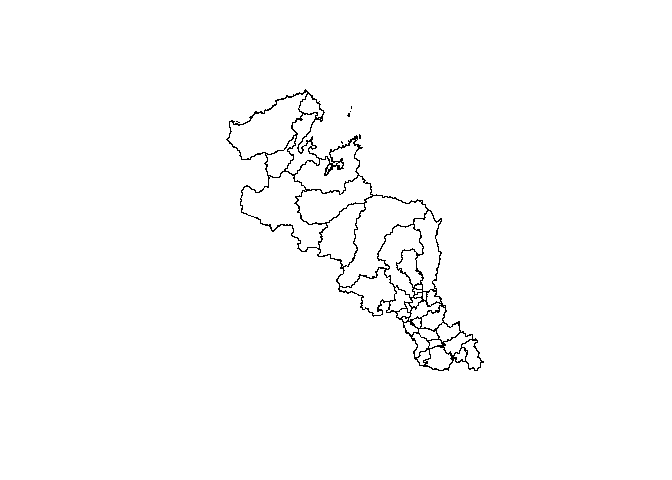
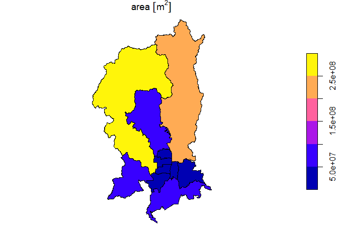

<!-- README.md is generated from README.Rmd. Please edit that file -->

# kyotocities

<!-- badges: start -->
<!-- badges: end -->

kyotocities is package provides the Kyoto Prefecture administrative area
data in an easy-to-use format in R. These data are provided by the
[National Land Information
System](https://nlftp.mlit.go.jp/ksj/gml/datalist/KsjTmplt-N03-v3_1.html).
This package uses data in 2023 (Reiwa 5).

> kyotocitiesは京都府の行政区域データをRで扱いやすい形式で提供するパッケージです。
> これらのデータは[国土数値情報ダウンロードサービス](https://nlftp.mlit.go.jp/ksj/gml/datalist/KsjTmplt-N03-v3_1.html)によって提供されています。
> なお、このパッケージでは令和5年のデータを使用しています。

## Installation

You can install the development version of kyotocities like so:

> kyotocitiesの開発版は以下のコマンドからインストールできます。

``` r
install.packages("remotes")
remotes::install_git("https://maslab.aitech.ac.jp/gitlab/ando/kyotocitiesdev")
```

## Usage

Load the package as follows:

> パッケージを以下のようにして読み込みます。

``` r
library(kyotocities)
```

### Show district information

The package provides administrative district information into `tibble`
format. You can show all the information as follows:

> このパッケージは行政区域データを`tibble`形式で提供します。
> 以下のようにして全ての情報を表示することができます。

``` r
kyoto_districts
#> Simple feature collection with 36 features and 4 fields
#> Geometry type: GEOMETRY
#> Dimension:     XY
#> Bounding box:  xmin: 134.8537 ymin: 34.70575 xmax: 136.0555 ymax: 35.77926
#> Geodetic CRS:  WGS 84
#> # A tibble: 36 × 5
#>    city_code city                    city_kanji   area                      geom
#>  * <chr>     <chr>                   <chr>       [m^2]             <POLYGON [°]>
#>  1 26101     Kyoto-shi Kita-ku       京都市 北… 9.49e7 ((135.7253 35.17083, 135…
#>  2 26102     Kyoto-shi Kamigyo-ku    京都市 上… 7.03e6 ((135.7506 35.03822, 135…
#>  3 26103     Kyoto-shi Sakyo-ku      京都市 左… 2.47e8 ((135.8048 35.31709, 135…
#>  4 26104     Kyoto-shi Nakagyo-ku    京都市 中… 7.41e6 ((135.7319 35.02254, 135…
#>  5 26105     Kyoto-shi Higashiyama-… 京都市 東… 7.48e6 ((135.7847 35.01038, 135…
#>  6 26106     Kyoto-shi Shimogyo-ku   京都市 下… 6.78e6 ((135.7698 35.00429, 135…
#>  7 26107     Kyoto-shi Minami-ku     京都市 南… 1.58e7 ((135.7256 34.98558, 135…
#>  8 26108     Kyoto-shi Ukyo-ku       京都市 右… 2.92e8 ((135.7298 35.26636, 135…
#>  9 26109     Kyoto-shi Fushimi-ku    京都市 伏… 6.17e7 ((135.7813 34.97397, 135…
#> 10 26110     Kyoto-shi Yamashina-ku  京都市 山… 2.87e7 ((135.811 35.01557, 135.…
#> # ℹ 26 more rows
```

The package already provides the data, but you can also download the
original data using `download_kyoto_district_data()` or read this using
`read_kyoto_district_data()`. Use these functions when you want to check
the original data or use it for other purposes.

> このパッケージでは、すでにデータを`tibble`形式していますが、
> もとのデータを`download_kyoto_district_data()`を使ってダウンロードしたり、
> `read_kyoto_district_data()`を使って読み込んだりすることもできます。
> もとのデータを確認したいときや、
> 他の目的で使いたいときにこれらの関数を使ってください。

### Search districts

You can search the district information by part of the city name. The
search is available in both English and Japanese as follows:

> 市区町村の名前の一部から行政区域情報を検索することができます。
> この検索は次のように日本語と英語の両方に対応しています。

``` r
# Search districts by part of city name (en)
find_districts("Fukuchiyama")
#> Simple feature collection with 1 feature and 4 fields
#> Geometry type: POLYGON
#> Dimension:     XY
#> Bounding box:  xmin: 134.9171 ymin: 35.16061 xmax: 135.3251 ymax: 35.46973
#> Geodetic CRS:  WGS 84
#> # A tibble: 1 × 5
#>   city_code city            city_kanji       area                           geom
#>   <chr>     <chr>           <chr>           [m^2]                  <POLYGON [°]>
#> 1 26201     Fukuchiyama-shi 福知山市   552535237. ((135.1264 35.46951, 135.1261…

# Search districts by part of city name (jp)
find_districts("綾部")
#> Simple feature collection with 1 feature and 4 fields
#> Geometry type: POLYGON
#> Dimension:     XY
#> Bounding box:  xmin: 135.1728 ymin: 35.26385 xmax: 135.5348 ymax: 35.45449
#> Geodetic CRS:  WGS 84
#> # A tibble: 1 × 5
#>   city_code city      city_kanji       area                                 geom
#>   <chr>     <chr>     <chr>           [m^2]                        <POLYGON [°]>
#> 1 26203     Ayabe-shi 綾部市     347102760. ((135.4709 35.45396, 135.4705 35.45…
```

### Plot administrative districts

You can easily create a map of Kyoto Prefecture using the package. The
following code shows an example of creating a map of the entire Kyoto
Prefecture and Kyoto-shi.

> このパッケージを使って京都府の地図を簡単に作成することができます。
> 以下のコードは京都府全体と京都市の地図を作成する例を示しています。

``` r
# Plot the all administrative districts of the entire Aichi Prefecture
plot(kyoto_districts["geom"])
```



``` r
# Plot the administrative districts of Nagoya by size of area
plot(find_districts("Kyoto-shi")["area"])
```



## Similar projects

- [uribo/jpndistrict](https://github.com/uribo/jpndistrict)
- [cran/NipponMap](https://github.com/cran/NipponMap)
- [NONONOexe/aichicities](https://github.com/NONONOexe/aichicities)

## License

This project is licensed under the [Creative Commons Attribution 4.0
International License](https://creativecommons.org/licenses/by/4.0/).

> このプロジェクトは[クリエイティブ・コモンズ 表示 4.0 国際
> ライセンス](https://creativecommons.org/licenses/by/4.0/deed.ja)に従います。

## Code of Conduct

Please note that this project is released with a [Contributor Code of
Conduct](CODE_OF_CONDUCT.md). By participating in this project you agree
to abide by its terms.

> このプロジェクトは[行動規範](CODE_OF_CONDUCT.md)を設けています。
> したがって、このプロジェクトでは参加者にこの行動規範に従うことを求めます。
